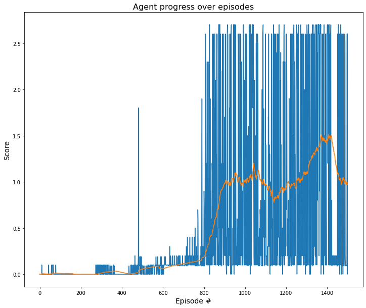

[//]: # (Image References)

[score-progress]: media/score-progress.png "Score Progress"
[rewards-training]: media/rewards-training.png "Rewards Training"

# MADDPG - Collaboration & Competition - Project Report

This solution impleents a Multi-Agent Deep Deterministic Policy Gradient (MADDPG) algorithm [
 [Lowe et al. 2017](http://arxiv.org/abs/1706.02275), to solve a multi-agent collaborative task in which a two agents (tennis rackets) need to keep the ball in the air, bouncing it to each other. MADDPG is an expansion of DDPG which adapts the later to work with multi agent environments. Multi-agent environments are a special and difficult kind of tasks which can be collaborative (as in this case) or competitive, the agents need to be aware not only about the environment but the other agents as well, and since they are also learning, this converts the environment in non-stationary environment, making the learning progress much harder. 

What MADDPG does is that each agent policy (agent) is learnt independently but evaluated with a centralized Q-function (critic) which contains information about the other agents. This way, the agent decision is decoupled from the state of other agents which breaks non-stationarity, but during training it is evaluated against the other agents to include this information to perform the updates.

Each agent is trained separately, each policy is updated as per the agents individual observations but evaluated against a gloabl critic which contains global state information as well as the actions other agents took with their corresponding observations.

This decoupling of what the agent's policy observes and acts, what is used to evaluate its actions, and the fact that during execution or rollouts, the agent only uses its local observation to take action, is what makes the multi-agent learning possible.

## Network definition

Both actor and critic follow a similar network architecture. The differences between them are 1) the critic network needs to account for the actions taken to obtain the Q-value'2) the actor uses 'tanh' in the last layer, whereas the critic is just the linear function. The general architecture is as follows.

* Three fully connected linear layers of `256`, `128`, and `64` units each.
* Inner layers activation function is `ReLu`.
* Actor uses `tanh` for final activation layer.
* Critic do not use activation function in the last layer.
* The optimizer used was Adam with its default values except for the learning rate.
* Use Huber loss for the critic.

## Replay buffer definition
We need to use the experience replay buffer. Hence this structure defines the minimal logic for a experience replay buffer.

## DDPG Agent
This DDPG agent defines a single agent logic. Here we define the actual agent which combines both networks, the replay buffer, the noise generation, and adds the action selection strategy, except the learning steps. Given this is a multi-agent scenario and learning steps needs to consider all agents, so the learning step is taken out from this class and used on a more general class later.

## MADDP driver
This structure combines the agents and learning togheter, hence the 'driver' codename. In this class we mix up all the agents, how to take the actions and finally the learning step. As mentioned above, the learning step in MADDPG requires interactions and inputs from all the agents. Hence, here we mix them all and perform the learning updates.

## Hyperparameters

This project run one experiment with hyper-parameters as follow:

### Neural Network training hyperparameters
* actor learning rate: `5e-4`
* critic learning rate: `5e-4`
* $\tau$ (soft updates): `1e-3`
* weight decay: 0


### DDPG parameters
* Max number of episodes for training: `1500`
* Max number of steps per episode: `1500`
* $\gamma$: 0.99

### Other parameters
* random seed: 123
* batch size: `128`
* Replay buffer size: `1e6`
* noise scale: `4.0`
* noise decay: `9e-4`

## Results
### DDPG Training output
```bash
100%|██████████| 1500/1500 [1:57:33<00:00,  4.70s/it, Avg. Score=0.97]
```
Tensorboard logs: ![Average Score Progress][score-progress]

According to the training progress, the criteria to determine this task is solved (+0.5 avg score over 100 episodes) was reached around step 846 (see tensorboard logs above). A peak score of +1.5 avg score over 100 episodes was reached around episode 1423, these are good results. 

One significant aspect that contributed to these results was experimenting with the noise. The defailt noise strategy is a standard Ulehnbeck & Orstein Noise with $\mu=0$, $\theta=0.15$, and $\sigma=0.2$ . However, I added two additional parameters to the noise process a `scale` and `scale_decay` which added flexibility on how much noise I wanted to apply to the action selection and how much I wanted to deminish it during progress. The `scale` parameter determines how much I desire to multiply the generated noise, for instance if I want large amounts of noise, I would put bigger values. The `scale_decay` parameter indicates how much I want to decrease the noise after each noise sampling, this ensures the generated noise becomes smaller each time.

The noise is of paramount importance in these kind of tasks because in their initial states, the agents needs to explore in order to get meaninful trajectories from where to derive good policy updates. If too small or no noise is used, the agents will not be able to experiment actions that would lead to useful outcome. Furthermore, it is important to decay this noise periodically so the agents account for exploitantion. Finally, reseting the noise after each episode, including the scale, further helps in exploration and account for different environment combinations.

<div style="text-align:center">

</div>


### Concluding remarks

MADDPG is a powerful algorithm for multi-agent tasks and tasks with continous action spaces in general. This task was hard to solve in the beginning. It is important to be careful in implementing the learning procedure, ensuring the matrices dimensions match and the calculations part from well defined inputs. Several trial & error sessions were needed to find the best hyper-parameters and tweaks to the original algorithm in order to make it work. Nevertherless, it is really envigorating when you finally solve the task and watch the agent to some progress. It would be interesting to see how other policy gradient algorithms and techniques compare against this one just for learning purposes.

### Future work
- Implement the soccer challenge.
- Implement a competitive version of this task in which each agent needs to maximize its own score.
- Run more experiments and perform statistical analysis over the results.

### References
- Udacity - Deep Reinforcement Learning - Nano Degree: https://www.udacity.com/course/deep-reinforcement-learning-nanodegree--nd893
- Deterministic Policy Gradient Algorithms, [Silver et al. 2014](https://proceedings.mlr.press/v32/silver14.pdf)
- Continuous Control With Deep Reinforcement Learning, [Lillicrap et al. 2016](https://arxiv.org/abs/1509.02971)
- Multi-Agent Deep Deterministic Policy Gradient (MADDPG) algorithm, 
 [Lowe et al. 2017](http://arxiv.org/abs/1706.02275)