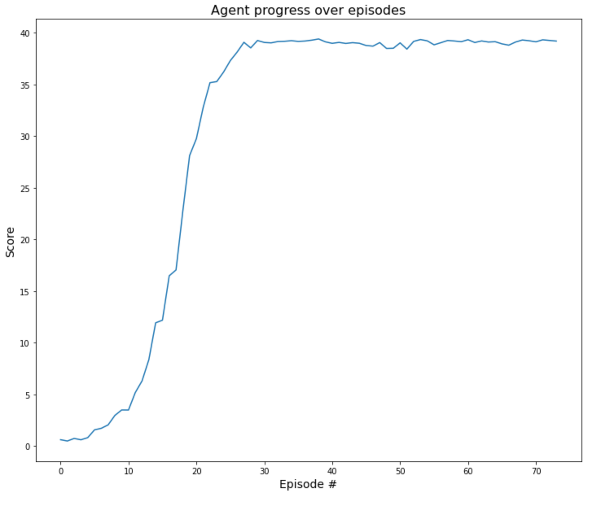

# DDPG - Continous Control - Project Report

This solution impleents a Deep Deterministic Policy Gradient (DDPG) algorithm [
 [Silver et al. 2014](https://proceedings.mlr.press/v32/silver14.pdf), [Lillicrap et al. 2016](https://arxiv.org/abs/1509.02971)] to solve a continpus control task in which a 2 joint arm is tasked to reach and follow a target.

## Network definition

Both actor and critic follow a similar network architecture. The differences between them are 1) the critic network needs to account for the actions taken to obtain the Q-value'2) the actor uses 'tanh' in the last layer, whereas the critic is just the linear function. The general architecture is as follows.

* Two fully connected linear layers of '256' and '128' units each.
* Inner layers activation function is `ReLu`.
* Actor uses `tanh` for final activation layer.
* Critic do not use activation function in the last layer.
* The optimizer used was Adam with its default values except for the learning rate.
* Use MSE loss for the actor.

## Replay buffer definition
We need to use the experience replay buffer. Hence the class below defines the minimal logic for a experience replay buffer.

## DDPG Agent
The DDPG agent logic includes mixing both the actor and the critic network as well as the action selection logic, and the learning process.

## Hyperparameters

This project run one experiment with hyper-parameters as follow:

### Neural Network training hyperparameters
* actor learning rate: `5e-4`
* critic learning rate: `5e-4`
* $\tau$ (soft updates): `1e-3`
* weight decay: 0


### DDPG parameters
* Max number of episodes for training: `10000`
* Max number of steps per episode: `1500`
* $\gamma$: 0.99

### Other parameters
* random seed: 123
* batch size: `128`
* Replay buffer size: `1e6`
* noise $\sigma$: `0.1`
* noise $\theta$: `0.15`

## Results
### DDPG Training output
```bash
 1%|          | 74/10000 [14:27<32:19:13, 11.72s/it, Avg. Score=30.08]
```
Using the 20x agents environment, the task is solved in 74 episodes. This takes a bit longer for x1 agent as it needs more steps to get more samples.

<div style="text-align:center">

</div>


### Concluding remarks

DDPG is a powerful algorithm for continuous control tasks and tasks with continous action spaces in general. This task was hard to solve in the beginning. Several trial & error sessions were needed to find the best hyper-parameters and tweaks to the original algorithm in order to make it work. Nevertherless, it is really envigorating when you finally solve the task and watch the agent to some progress. It would be interesting to see how other policy gradient algorithms and techniques compare against this one just for learning purposes.

### Future work
- Implement other PG algorithms and compare against this solution.
- Run more experiments and perform statistical analysis over the results.

### Credits
This solution was inspired by both [Udacity's pendulum solution](https://github.com/udacity/deep-reinforcement-learning/tree/master/ddpg-pendulum) & [Juan Carlos K](https://github.com/jckuri/DeepRL-Continuous-Control) adaptation to the reacher environment

### References
- Udacity - Deep Reinforcement Learning - Nano Degree: https://www.udacity.com/course/deep-reinforcement-learning-nanodegree--nd893
- Deterministic Policy Gradient Algorithms, [Silver et al. 2014](https://proceedings.mlr.press/v32/silver14.pdf)
- Continuous Control With Deep Reinforcement Learning, [Lillicrap et al. 2016](https://arxiv.org/abs/1509.02971)