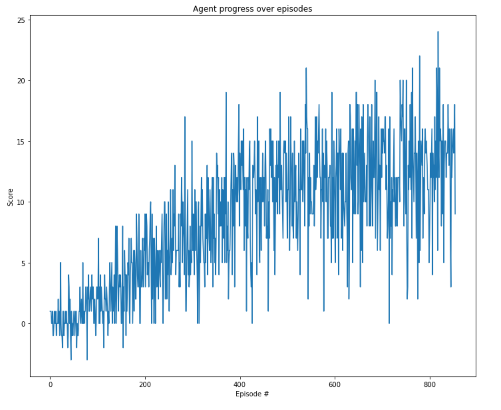
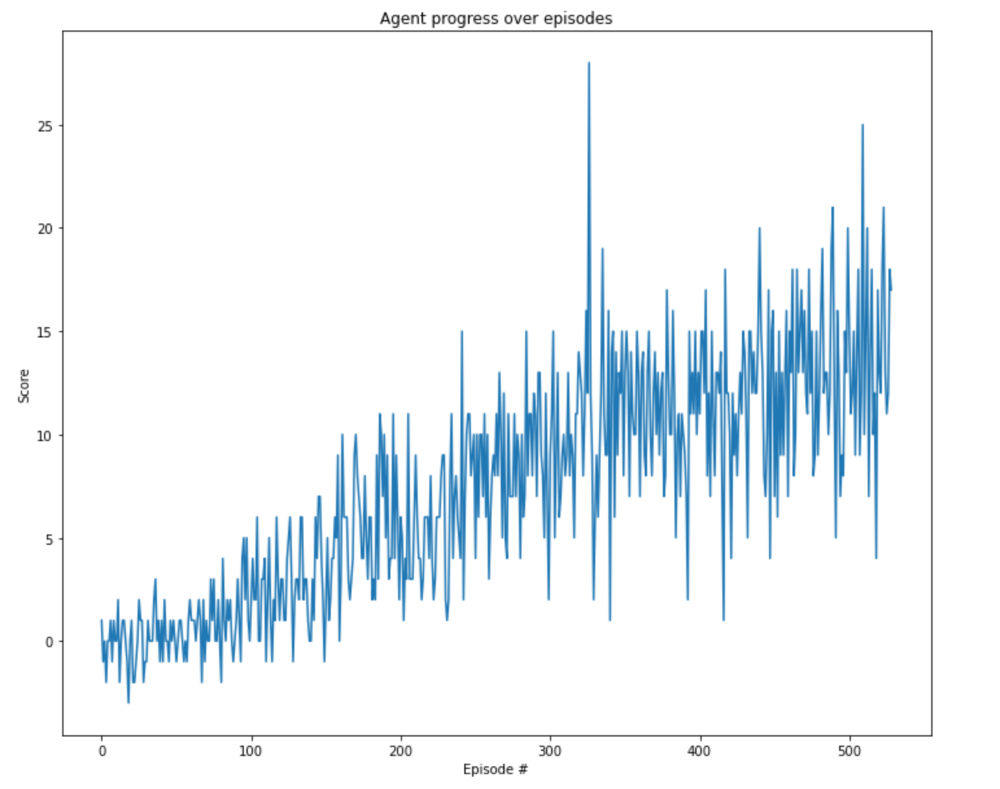
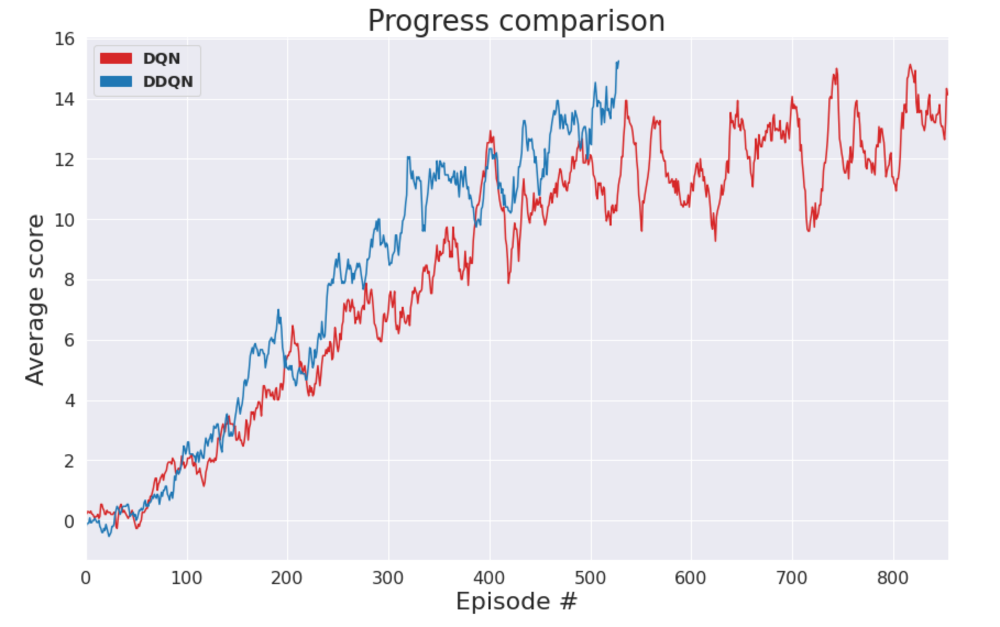

# DQN - Banana Navigation - Project Report

This solution implements the vanilla Deep Q-Learning algorithm presented by [Mnih et al.](http://www.nature.com/articles/nature14236) although this current solution does not exploit pixel data, but environment state embedding. This solution uses a simple dense neural network, a replay buffer and the integration code that brings everything together.

## Network definition

* Three fully connected linear layers of `256`, `128`, and `64` units each.
* One dropout between dense layers 1 and 2 with `0.2` ratio.
* The output layers receives the input of the thid linear layer and outputs a `4` elements vector, corresponding to the 4 possible actions. 
* For the three first layers, the activation function is `ReLU`.
* The last layer is only the linear output with no activation.
* The optimizer used was Adam with its default values except for the learning rate.

## Replay buffer definition
As part of the DQN algorithm, we need to use the experience replay buffer. Hence the class below defines the minimal logic for a experience replay buffer.

## DQN Agent
The DQN agent logic which is able to act (take action based on a provided state) and learn (perform a forward-backward pass on the QNetworks) as per DQN algorithm. This agent implements both classic DQN and [Double DQN](http://arxiv.org/abs/1509.06461), controlled by the parameter `use_double_q`.

## Hyperparameters

This project run two experiments, one for vanilla DQN and the other for Double-DQN. Both use the same hyper-parameters except for the fact that DDQN explicitly enables use of DDQN.

The general hyper-parameters are:

### Neural Network training hyperparameters
* learning rate: `1e-3`
* batch size: `64`
* Adam Optimizer with amsgrad
* MSE loss

### Q-Learning parameters
* Max number of episodes for training: `2000`
* Max number of steps per episode: `1000`
* Initial $\epsilon$ (epsilon): `1.0`
* Minimal $\epsilon$ : `0.01`
* $\epsilon$ decay: `0.995`

### Other parameters
* Replay buffer size: `1e6`
* $\tau$ (tau) : `5e-3` (smaller = target weights are more important)
* Learn frequency: `4` (Every 4 steps, run a learn step)

## Results
### DQN Training output
```bash
43%|████▎     | 855/2000 [23:18<31:12,  1.64s/it, Avg. Score=13.01]
```
Vanilla DQN solved the environment in `855` episodes with an average score of `13.01` over the last 100 episodes.

<div style="text-align:center">

</div>


### DDQN Training output
```bash
 26%|██▋       | 529/2000 [14:50<41:17,  1.68s/it, Avg. Score=13.05]
```
Double DQN solved the environment in `529` episodes with an average score of `13.05` over the last 100 episodes.


<div style="text-align:center">

</div>

### Head to head comparison
This plot presents how these two compares to each other. The returns obtained for each were averaged over a 15 instances window so the learning evolution can be appreciated more easily.


<div style="text-align:center">

</div>

### Concluding remarks

DQN is a powerful algorithm capable of solving simple and well defined tasks. In this particular example, DDQN performed slighlty better than vanilla DQN. For example, DDQN solved the task in less episodes than vanilla DQN, and achieved slightly better performance comparing their equivalen episodes. Nevertheless, it is worthy to explore other hyperparameters and improvements like Dueling DQN, prioritized experience replay, among others.

### Future work
- Implement other DQN improvements such as Dueling Q-Network and prioritized experience replay.
- Solve the task from raw pixels.
- Run hyperparameter tunning sessions.
- Run more experiments and perform statistical analysis over the results.

### References
- Udacity - Deep Reinforcement Learning - Nano Degree: https://www.udacity.com/course/deep-reinforcement-learning-nanodegree--nd893
- Human-level control through deep reinforcement
learning: http://www.nature.com/articles/nature14236
- Deep Reinforcement Learning with Double Q-learning: http://arxiv.org/abs/1509.06461
- Plotting RL results - [reddit thread](https://www.reddit.com/r/reinforcementlearning/comments/gnvlcp/way_to_plot_goodlooking_rewards_plots/)